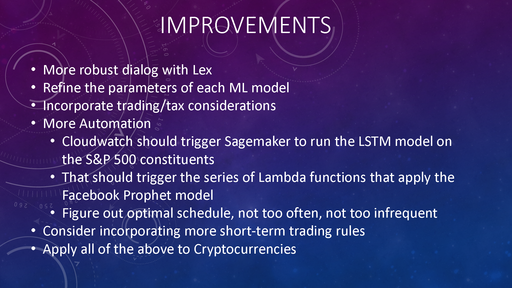

# Optimizing-stock-selection-with-Machine-Learning-and-Alternative-Weightings
Uses 2 different algorithms to select stocks out of the S&amp;P 500. Then backtests these stocks using 4 different weighting schemes.

## First, the Sagemaker notebook LSTM_toFeedInto_FB-Prophet uses Long Short-Term Memory  machine learning model to analyze the returns of the S&P 500 constituents. Then predicts the following month's returns for each issue. Then it ranks the stocks by predicted returns and takes the top 50 stocks and writes them and their returns to a S3 bucket.

## Next, the function "Get Prophet Returns Write to S3" reads in these returns and runs each stock through the Facebook Prophet Algorithm. This algorithm does more of a short term analysis to predict trends. Generally, out of 50 stocks, it selects 10 to 20 that have positive trends. It then writes these selected stocks to a S3 bucket.

## The function "Get Weights" pulls these selected stocks and then uses the StockNewsAPI to pull sentiment data on each stock for the last 30 days. This historical sentiment data is then fed into Facebook Prophet. Prophet outputs decisions on each stock based on its sentiment trend. Then I take the stocks selected on the basis of historical returns and the stocks seleted based on sentiment, and see if there is any overlap between the 2 sets. The overlapping stocks are then backtested at different weighting schemes using the past 2 years of data. The weighting schemes analyzed are:
* Equal Weight
* Equal Risk Contribution
* Maximum Sharpe Ratio
* Global Minimum Variance

## Finally, the function "Trade Stocks n Cryptos" pulls these weights and asks the user if they'd like to trade the stocks and if so, with which weighting scheme. If the user wishes to trade, the program trades the stocks in the user's Alpaca trading account using the Alpaca API

# Next Steps
___
## Next, I'd like to have all of these programs run automatically using triggers in AWS Cloudwatch.
___
# Some .gifs using AWS Lex:

___

___

